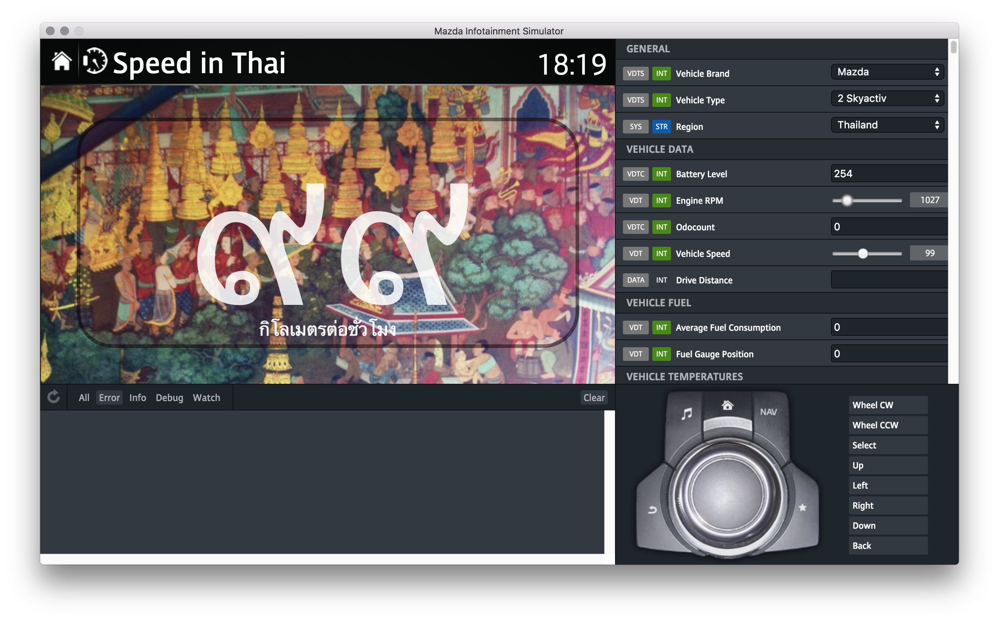

#ติดตั้ง CASDK บนระบบปฏิบัติการ windows10
1. สร้างโฟล์เดอร์ C:\CASDK
2. ดาวน์โหลดโปรแกรม [https://github.com/flyandi/mazda-custom-application-sdk/releases/download/0.0.1-alpha/casdk-simulator-0.0.1-alpha-win32.zip](https://github.com/flyandi/mazda-custom-application-sdk/releases/download/0.0.1-alpha/casdk-simulator-0.0.1-alpha-win32.zip) เก็บไว้ที่ C:\CASDK และคลายไฟล์คลิกขวาเลือก Extract All... ไม่ใช่ double click 
3. ดาวน์โหลดรันไทม์ [https://github.com/flyandi/mazda-custom-application-sdk/releases/download/0.0.1-alpha/casdk-alpha-0.0.2.zip](https://github.com/flyandi/mazda-custom-application-sdk/releases/download/0.0.1-alpha/casdk-alpha-0.0.2.zip) และคลายไฟล์แบบเดียวกับข้อ 1
4. เปิดโปรแกรม Mazda Infotainment Simulator.exe อยู่ใน C:\CASDK\casdk-simulator-0.0.1-alpha-win32\Mazda Infotainment Simulator-win32-ia32 พบหน้าจอในภาพด้านล่าง
 
5. เลือกเมนู Simulator อยู่ซ้ายมุมบน แล้วเลือก Choose Runtime Location เลือก C:\CASDK\casdk-alpha-0.0.2\sdcard\system แล้วจึงเลือกเมนู Reload Runtime
6. จากเมนู Simulator เลือก Choose Applications Location เลือก C:\CASDK\casdk-alpha-0.0.2\sdcard แล้วจึงเลือกเมนู Reload Applications
7. จบขั้นตอนติดตั้งโปรแกรม 

ซอสโค๊ดที่ใช้พัฒนา**แอพ**(ย่อจาก แอพพลิเคชั่น) บันทึกใน C:\CASDK\casdk-alpha-0.0.2\sdcard หลังจากพัฒนาเสร็จสิ้น เมื่อต้องการใช้โปรแกรมบนรถทำได้โดย copy ลง SDCARD ซึ่งจะต้องติดตั้งปลั๊กอินก่อนจึงใช้งานได้ มีคำอธิบายในหัวข้อต่อไป 

#การใช้งานจริง
**อยู่ในช่วงทดสอบ เมื่อไม่พบปัญหาจะเขียนอธิบายในคราวต่อไป** หากสนใจทดลอง ใช้โปรแกรมติดตั้งได้จาก https://github.com/flyandi/mazda-custom-application-sdk/releases/download/0.0.1-alpha/casdk-installer-0.0.3.zip แต่โปรดระวังอาจจะส่งผลกระทบต่อปลั๊กอินที่เคยติดตั้งมาก่อน ผมทดลองแล้วไม่พบปัญหากับปลั๊กอินเก่า แต่พบว่ามีรายการชื่อแอพแต่รันไม่ได้ อย่างไรก็ตามผู้ใช้เว็บไซต์ mazda3revolution.com ได้รายงานว่าแอพพลิเคชั่นทำงานได้ ผมจะตรวจสอบลำดับการติดตั้งในรายละเอียดอีกครั้ง

#ซอฟต์แวร์ CASDK
CASDK เป็นซอฟต์แวร์ใช้จำลองหน้าจอ MZD Connect รายการแอพจะปรากฏในเมนู Applications จากตัวอย่างที่ซอสโค๊ตเตรียมไว้ให้มีแอพ ดังนี้ 

* Dev Tools
* Hello World
* Multicontroller Demo
* Simple Dashboard
* Speedometer
* Tetris
* Vehicle Data Diagnostic

เมื่อเปิดโปรแกรมและเลือกแอพตัวอย่างเช่น Speedometer มีหน้าจอแบบภาพด้านล่าง

 

ตัวอย่างแอพต่อยอดจาก Simple Dashboard
 