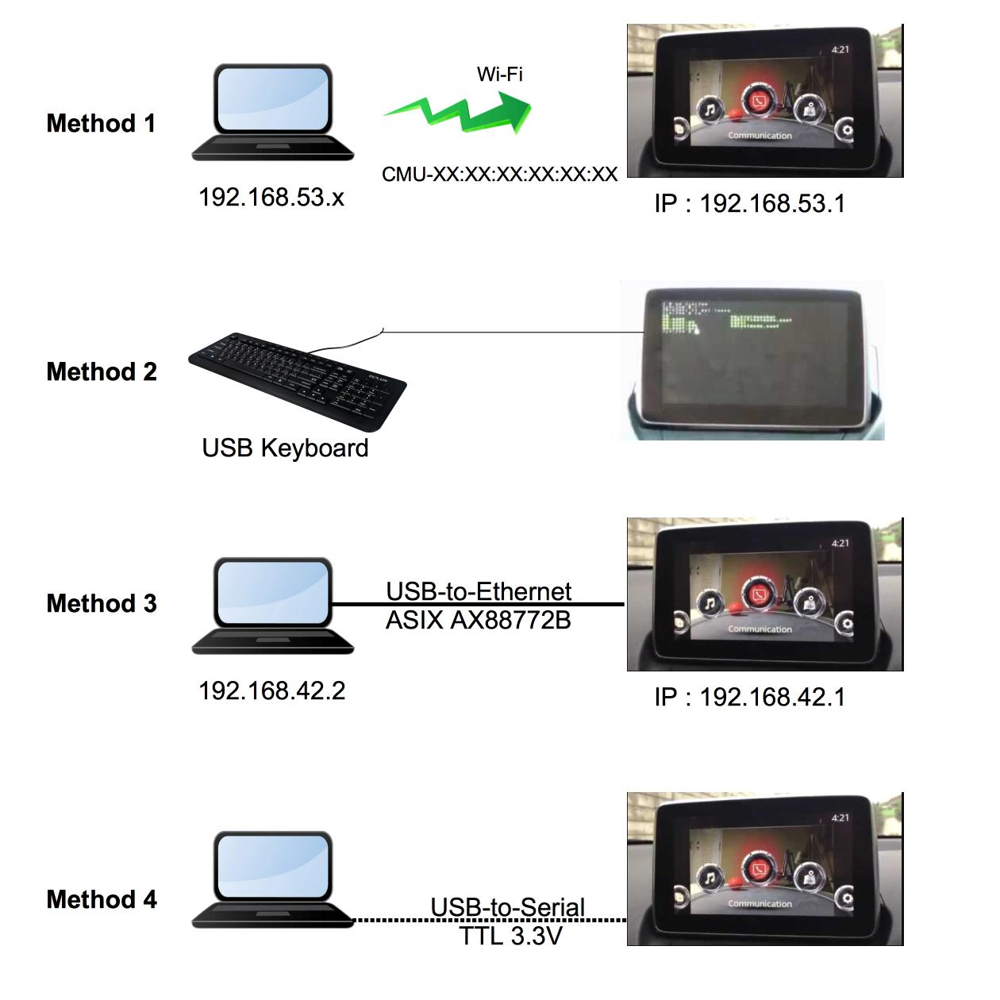

#### IMPORTANT: All changes happen at your own risk!
##### Anyone who is unsure should leave it alone, ask someone with experience to help or ask in the forum.
##### I am not responsible for damages that may incur from the use.

# CMU bringback

## Recovery libmc_user.so

### Problem
1. I can't login to the MZD FW56.00.513 by SSH. (Goto [Task 1](#task-1))
2. I don't have permission to modify the files. (Goto [Task 2](#task-2))
3. Problem still exist (### Its another issue)

### Task 1
To connect CMU. Choosing some method

#### Method 1: Enable WiFi AP Toggle
- CMU IP : 192.168.53.1/24

##### 1.1 JCI TEST Dialogue 
https://github.com/Siutsch/AIO---All-in-one-tweaks/blob/master/choose/docs/WIFI_AP_Toggle.txt

##### 1.2 USB Tweaks (In case cannot access JCI Dialogue)
https://github.com/mzdonline/cmu-wifiap

#### Method 2: Terminal Console

This method may not solve the problem because of USB issue.

<a href="http://www.youtube.com/watch?feature=player_embedded&v=M-iJLuxwfzU" target="_blank"></a>

#### Method 3: USB-to-Ethernet
This method may not solve the problem because of USB issue.

- USB to Ethernet Device chipset : ASIX AX88772B
- CMU IP : 192.168.42.1/24

http://mazda3revolution.com/forums/2014-2016-mazda-3-skyactiv-audio-electronics/57714-infotainment-project-46.html
http://mazda3revolution.com/forums/1309434-post1636.html
http://mazda3revolution.com/forums/1610993-post4935.html
http://mazda3revolution.com/forums/1286058-post1557.html

#### Method 4: Serial Console
- USB to Serial device chipset : FT232RL (TTL 3.3V)

https://www.drive2.ru/l/452929522484904460/




### Task 2

Ref : http://mazda3revolution.com/forums/1280610-post1532.html

Put shell code in `/data_persist/dev/bin/autorun`.

* Example (`/data_persist/dev/bin/autorun`)

```bash
#!/bin/sh
# /data_persist/dev/bin/autorun
echo 1 > /sys/class/gpio/Watchdog\ Disable/value
sleep 40
if [ -e /mnt/sd_nav/run.sh ]
then
  sh /mnt/sd_nav/run.sh
fi
```

```bash
# typing command in car
# to allow execution
chmod +x /data_persist/dev/bin/autorun
```
You can put `run.sh` in SDCard to execute command without SSH to CMU.

Try command below for testing
```bash
#!/bin/sh
# dry run example : run.sh
/jci/tools/jci-dialog --title="Ready" --text="AUTORUN Activated" --ok-label='OK' --no-cancel
```

**Be very careful** to use below script.

```bash
#!/bin/sh
# SD Card : run.sh
PATH=$PATH:/bin:/sbin:/usr/bin:/usr/sbin
echo 1 > /sys/class/gpio/Watchdog\ Disable/value
mount -o rw,remount /

#Put your command here
#Example recovery libmc_user.so
cp -a /mnt/sd_nav/libmc_user.so.511A-EU /jci/lib/libmc_user.so

#Recommend: propose protection code to prevent Bootloop 
sed -i 's/watchdog_enable=\"true\"/watchdog_enable=\"false\"/g' /jci/sm/sm.conf
sed -i 's|args=\"-u /jci/gui/index.html\"|args=\"-u /jci/gui/index.html --noWatchdogs\"|g' /jci/sm/sm.conf
mount -o ro,remount /
```

Then copy file from ([#Link Original libmc.so]( https://github.com/Siutsch/AIO---All-in-one-tweaks/tree/master/choose/config_org_all/media-order-patching/jci/lib)) to SDcard. Put it to car and reboot.

Next boot the CMU will execute command by root privillege.
