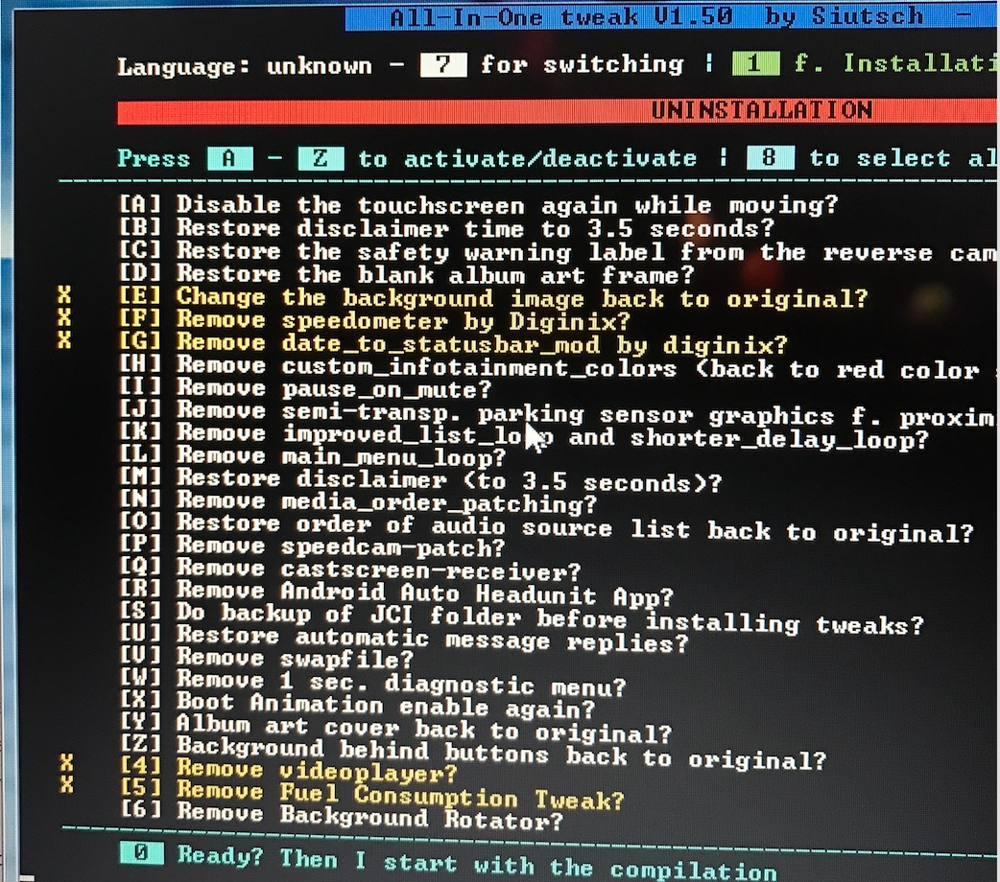
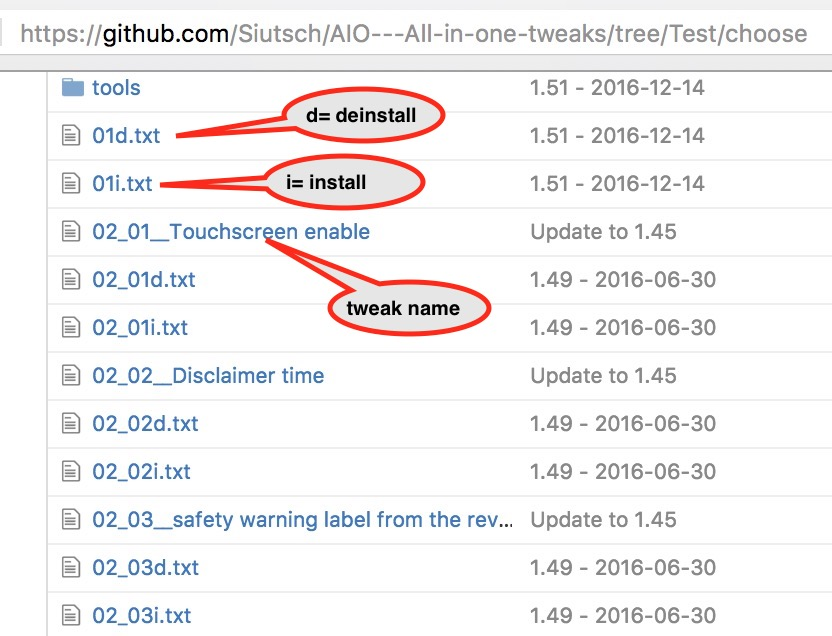

# กรณีตัวอย่าง
เกิดหน้าจอค้างหลังเปลี่ยน background ใช้ Serial Console เชื่อม CMU ตรวจพบการใช้เนื้อที่ /root พบเนื้อที่เต็ม ได้ลบข้อมูลบางส่วนจนเหลือพื้นที่เพียงพอต่อการกู้ไฟล์ sm.conf และ background.png จนทำให้หน้าจอบูทได้ ต่อมาใช้ AIO(ไม่ทราบเวอร์ชั่น) สร้างไฟล์ uninstallทุกปลั๊กอิน หลังรีบูทเกิด reboot loop ได้แก้ไขให้หยุด reboot loop ได้สำเร็จ แต่หน้าจอยังค้าง

จากรูปได้ uninstall  [E],[F],[G],[4] และ [5]

# ชี้แจง
ถ้าเป็นปัญหาที่ค้นคำตอบได้จากอินเทอร์เน็ตผมจะสรุปเป็นลำดับขั้นและอธิบายว่าแก้ไขได้ แต่ถ้าเป็นปัญหาที่ไม่เคยพบหรือค้นไม่พบ(ไม่มีคนแชร์)ทำให้แก้ยากเช่นปัญหานี้ จะช่วยเหลือเท่าที่ทำได้ คำสั่งด้านล่างนี้ไม่ใช่คำสั่งแก้ปัญหาแบบที่เดียวจบ แต่เป็นการทำความเข้าใจปัญหาแล้วแก้ไขทีละจุดโดยใช้ความรู้พื้นฐานคำสั่งลินุกซ์ อ้างอิงจากข้อมูลที่ให้มาและความรู้ที่ผมมี

# แนวทาง
ใช้วิธีตามแก้ไขทีละไฟล์ ไม่แนะนำให้ copy /jci ทับไฟล์เก่า เพราะทำให้ไฟล์ในระบบถูกแก้ไขเวลา(timestamp) นอกจากแก้ปัญหาไม่ได้แล้วยังทำให้ปัญหายากขึ้น

1. ค้นหาไฟล์ที่ถูกแก้ไขล่าสุด
2. กู้ไฟล์ที่ถูกแก้ไขล่าสุด ยกเว้น sm.conf เพราะถูกแก้ไขเพื่อป้องกัน reboot loop
3. หลังจากกู้ไฟล์ ทดลอง reboot ถ้ายังไม่ได้ กลับไปทำข้อ1 แก้ไฟล์ใหม่ จนกว่าจะเข้าหน้าหลักได้

คำสั่งค้นไฟล์ที่ถูกแก้ไขล่าสุด ใช้[ค้นหาไฟล์เรียงตามวัน](### ค้นหาไฟล์เรียงตามวัน) เมื่อได้รายการไฟล์มาแล้วให้กู้คืนทีละไฟล์ จนกว่าจะบูทได้

## เตรียมพร้อม
- ไฟล์ backup jci เฟิร์มแวร์ 56.00.240B หรือขอจากสมาชิกท่านอื่น
- กู้ไฟล์ `sm.conf` ([กู้ไฟล์ sm.conf](#กู้ไฟล์ sm.conf))

# รวมคำสั่ง command line

### ค้นหาไฟล์นามสกุล 'org'
AIO สร้างไฟล์สำรองมีนามสกุล org เมื่อแก้ไขไฟล์ เช่น ไฟล์ sm.conf มีไฟล์สำรองชื่อ sm.conf.org ใช้วิธีนี้ค้นหาและเลือกกู้ไฟล์ได้เร็ว
```bash
find / -type f -name '*.org' 2>/dev/null
```
ถ้าไฟล์มีมาก ใช้คำสั่ง `| head -n 10` เพื่อให้แสดงผล 10บรรทัด
```bash
find / -type f -name '*.org' 2>/dev/null|head -n 10
```
### ค้นหาไฟล์เรียงตามวัน
จำวันที่แก้ไขไฟล์ได้แต่จำชื่อไฟล์ไม่ได้ ใช้คำสั่งด้านล่างเพื่อช่วยย่นเวลาค้นไฟล์ที่เคยแก้ไข
เช่น วันที่ 1ธค2559 เวลา 10:00น. แปลงเป็น YYYYMMDDhhmm => 201612011000

```bash
touch -t 201612011000 dummy.txt
find /jci -newer dummy.txt -type f -exec /bin/ls -l {} \; 2>/dev/null
```

### เปรียบเทียบไฟล์
เปรียบเทียบไฟล์ sm.conf กับ sm.conf.org ถ้าเหมือนกันจะไม่มีข้อความ เครื่องหมาย "-", "+" หมายถึงข้อความที่ต่างกัน "-" หมายถึงมีใน sm.conf.org แต่ไม่มีใน sm.conf

```bash
diff -Naur sm.conf sm.conf.org
```

ตัวอย่าง
```bash
/jci/sm # diff sm.conf sm.conf.org
--- sm.conf
+++ sm.conf.org
@@ -21,7 +21,6 @@

     <!--  Service description format: name path [args] [priority] [depends] [retry] -->
     <services type="process" reset_board="no" retry_count="0" sched_policy="SCHED_OTHER" sched_priority="0" autorun="yes" affinity_mask="0x01" ping_timeout="8000" stop_timeout="3000" save_at_shutdown="no">
-        <service type="process" name="input_filter" path="/tmp/mnt/data_persist/dev/mazda-connector/input_filter" autorun="yes" reset_board="no" retry_count="0" affinity_mask="0x02"/>

         <!-- ======================= PID waiting Services =============================================== -->

@@ -95,7 +94,6 @@
         <service type="jci_service" name="devices" path="/jci/devices/svc-com-jci-cpp-devices.so" autorun="yes" retry_count="0" args="" reset_board="yes" affinity_mask="0x02">
             <dependency type="service" value="stage_1"/>
             <dependency type="service" value="settings"/>
-            <dependency type="service" value="input_filter"/>
         </service>

         <service type="jci_service" name="jciNativegui" path="/jci/nativegui/svcjcinativegui.so" autorun="yes" retry_count="6" args="" reset_board="no" affinity_mask="0x02">
```

### กู้ไฟล์
กู้ไฟล์คือเอาไฟล์เก่าไปทับไฟล์ใหม่ ไฟล์เก่าได้จากไฟล์ที่เคย backup ไว้ ตัวอย่าง กู้ไฟล์ `opera.ini.org` เป็นไฟล์ `opera.ini`
```bash
cp -a /jci/opera/opera_home/opera.ini.org /jci/opera/opera_home/opera.ini
```

### เปลี่ยน /jci เป็นอ่านข้อมูลใน USB
สถานะ : เป็นแนวคิด ยังทำงานไม่ได้
จาก [M3R](http://mazda3revolution.com/forums/1899490-post5959.html) รู้ว่า mount /jci จากไดร์ฟภายนอกได้ ใช้วิธี copy file ต้นฉบับที่ได้จาก [S] เลือกเฉพาะ /jci ใส่ USB ฟอร์แมตเป็น ext4


* ที่เครื่องคอมพิวเตอร์
ใช้ระบบปฏิบัติการลินุกซ์ubuntu ฟอร์แมต USB เป็น ext4 ใช้คำสั่ง `fdisk` ลบพาร์ติเชั่นเดิม(คำสั่ง `d`)แล้วสร้างใหม(คำสั่ง `n`)และ ใช้คำสั่ง `mkfs.ext4` เพื่อแปลงพาร์ติดชั่นเป็นชนิ ext4

```bash
sudo mount /dev/sda1 /mnt
cd /mnt
sudo tar xf ~/cmu150_ADR56.00.513/reinstall/rootfs1upd/e0000000001.dat .
cd
sudo umount /mnt
```

* ที่รถ
```bash
mount -t ext4 -o defaults /dev/sda1/ /tmp/mnt/sda1
mount --bind /tmp/mnt/sda1/jci /jci
```

### เซต owner
เฟิร์มแวร์ 56.00.100/230/240 มี owner uid=1018 gid=3015 คำสั่งเปลี่ยน owner

```bash
mount -o rw,remount /
chown -R 1018:3015 /jci/sm/sm.conf
```
### รายการไฟล์ที่ AIO แก้ไขเมื่อ uninstall [E],[F],[G],[4] และ [5]
* [E] Individual background image
* [F] Speedometer, Media Player, Reboot
* [G] Date_to_statusbar
* [4] Video player
* [5] Fuel Consumtion Tweak

https://github.com/Siutsch/AIO---All-in-one-tweaks/tree/Test/choose

ไฟล์เกี่ยวข้อง

* 02_05d.txt

```bash
# restore background image to original
show_message "RESTORE BACKGROUND IMAGE TO ORIGINAL ..."
cp -a ${MYDIR}/config_org/background.png /jci/gui/common/images
log_message "=== RESTORED BACKGROUND IMAGE ==="
log_message " "
```

* 03d.txt

```bash
# Remove "Speed-Video-Reboot"
show_message "REMOVE SPEEDOMETER ..."
log_message "REMOVE SPEEDOMETER ..."

### kills all WebSocket daemons
pkill websocketd

cp /jci/scripts/stage_wifi.sh ${MYDIR}/stage_wifi_speedometer-before.sh
cp /jci/opera/opera_dir/userjs/additionalApps.json ${MYDIR}/additionalApps_speedometer-1._before.json

# check for 1st line of stage_wifi.sh
if grep -Fq "#!/bin/sh" /jci/scripts/stage_wifi.sh
	then
		echo "OK"
		log_message "=== 1st line of stage_wifi.sh is OK ==="
	else
		cp -a ${MYDIR}/config_org/speedometer/stage_wifi.sh /jci/scripts/
		log_message "=== Missing 1st line of stage_wifi.sh, copied new one ==="
fi

sed -i '/Speedo-Compass-Video_Tweak/d' /jci/scripts/stage_wifi.sh
sed -i '/v3.2/d' /jci/scripts/stage_wifi.sh
sed -i '/Removed requirement/d' /jci/scripts/stage_wifi.sh
sed -i '/# mount /d' /jci/scripts/stage_wifi.sh
sed -i '/Added additional/d' /jci/scripts/stage_wifi.sh
sed -i '/get-vehicle-speed.sh/d' /jci/scripts/stage_wifi.sh
sed -i '/get-vehicle-data-other.sh/d' /jci/scripts/stage_wifi.sh
sed -i '/get-gps-data.sh/d' /jci/scripts/stage_wifi.sh
sed -i '/Need to set defaults/d' /jci/scripts/stage_wifi.sh
sed -i '/myVideoList /d' /jci/scripts/stage_wifi.sh
sed -i '/playbackAction /d' /jci/scripts/stage_wifi.sh
sed -i '/playbackOption /d' /jci/scripts/stage_wifi.sh
sed -i '/playbackStatus /d' /jci/scripts/stage_wifi.sh
sed -i '/playback/d' /jci/scripts/stage_wifi.sh
sed -i '/myVideoList/d' /jci/scripts/stage_wifi.sh
sed -i '/Video player action watch/d' /jci/scripts/stage_wifi.sh
sed -i '/playback-action.sh/d' /jci/scripts/stage_wifi.sh
sed -i '/Log data collection/d' /jci/scripts/stage_wifi.sh
sed -i '/get-log-data/d' /jci/scripts/stage_wifi.sh
sed -i '/### Speedometer/d' /jci/scripts/stage_wifi.sh
sed -i '/addon-speedometer.sh &/d' /jci/scripts/stage_wifi.sh
sed -i '/speedometer.sh &/d' /jci/scripts/stage_wifi.sh
sed -i '/addon-player.sh &/d' /jci/scripts/stage_wifi.sh
sed -i '/mount of SD card/d' /jci/scripts/stage_wifi.sh
sed -i '/sleep 40/d' /jci/scripts/stage_wifi.sh
sed -i '/sleep 55/d' /jci/scripts/stage_wifi.sh
sed -i '/sleep 50/d' /jci/scripts/stage_wifi.sh
sed -i '/umount -l/d' /jci/scripts/stage_wifi.sh
sed -i '/sleep 25/d' /jci/scripts/stage_wifi.sh
sed -i '#mount /dev/sda1#d' /jci/scripts/stage_wifi.sh

sed -i '/sleep 4/d' /jci/scripts/stage_wifi.sh
sed -i '/sleep 6/d' /jci/scripts/stage_wifi.sh


# delete speedometer entry from /jci/opera/opera_dir/userjs/additionalApps.json
if grep -Fq "_androidauto" /jci/opera/opera_dir/userjs/additionalApps.json
	then
		log_message "=== Found androidauto entry in /jci/opera/opera_dir/userjs/additionalApps.json ==="
		appmenu_androidauto=1
	else
		log_message "=== No androidauto entry found in /jci/opera/opera_dir/userjs/additionalApps.json ==="
		appmenu_androidauto=0
fi
if grep -Fq "_videoplayer" /jci/opera/opera_dir/userjs/additionalApps.json
	then
		log_message "=== Found videoplayer entry in /jci/opera/opera_dir/userjs/additionalApps.json ==="
		appmenu_videoplayer=1
	else
		log_message "=== No videoplayer entry found in /jci/opera/opera_dir/userjs/additionalApps.json ==="
		appmenu_videoplayer=0
fi
if [ ${appmenu_androidauto} = "0" ] && [ ${appmenu_videoplayer=1} = "0" ]
	then
		log_message "=== No more entrys in additionalApps.json, files will be deleted ==="
		rm -f /jci/opera/opera_dir/userjs/additionalApps.*
	else
		remove_app_json "_speedometer"
fi

### cleanup old versions
if [ ! -d /jci/gui/apps/_videoplayer ]; then
	rm -fr /jci/gui/addon-common
	log_message "=== Removed /jci/gui/addon-common because videoplayer isn't installed neither ==="
fi
rm -fr /jci/gui/addon-player
rm -fr /jci/gui/addon-speedometer
rm -fr /jci/gui/speedometer
rm -fr /jci/gui/apps/_speedometer
rm -f /jci/opera/opera_dir/userjs/addon-startup.js
rm -f /jci/opera/opera_dir/userjs/mySpeedometer*
rm -f /jci/opera/opera_dir/userjs/speedometer*
mv /jci/opera/opera_dir/userjs/fps.js /jci/opera/opera_dir/userjs/fps.js.org
rm -f /jci/scripts/get-gps-data*
rm -f /jci/scripts/get-log-data*
rm -f /jci/scripts/get-vehicle-data-other*
rm -f /jci/scripts/get-vehicle-gear*
rm -f /jci/scripts/get-vehicle-speed*
rm -f /jci/scripts/stage_wifi.sh.bak?

cp /jci/scripts/stage_wifi.sh ${MYDIR}/stage_wifi_speedometer-after.sh

log_message "REMOVED SPEEDOMETER"
log_message " "
```

* 04d.txt

```bash
# remove "Date_to_Statusbar mod by diginix"
show_message "REMOVE DATE_TO_STATUSBAR_MOD BY DIGINIX ..."
log_message "REMOVE DATE_TO_STATUSBAR_MOD BY DIGINIX ..."

statusbar_copy_file=all

if [ ${CMU_SW_VER} = "59.00.326A-ADR" ] \
|| [ ${CMU_SW_VER} = "59.00.331A-EU" ]
	then
		statusbar_copy_file=59.00.326A-ADR
		log_message "=== FW ${CMU_SW_VER} detected, restoring matching files ==="
fi

if test -s /jci/gui/common/controls/Sbn/css/SbnCtrl.css.org
	then
		rm -f /jci/gui/common/controls/Sbn/css/SbnCtrl.css
		mv /jci/gui/common/controls/Sbn/css/SbnCtrl.css.org /jci/gui/common/controls/Sbn/css/SbnCtrl.css
		log_message "=== Restored backup from SbnCtrl.css.org ==="
	else
		cp -a ${MYDIR}/config_org/date-to-statusbar_mod/jci/gui/common/controls/Sbn/css/SbnCtrl.${statusbar_copy_file}.css /jci/gui/common/controls/Sbn/css/
		log_message "=== No backup found, copied original SbnCtrl.css from SD card ==="
fi

if test -s /jci/gui/common/controls/StatusBar/css/StatusBarCtrl.css.org
	then
		rm -f /jci/gui/common/controls/StatusBar/css/StatusBarCtrl.css
		mv /jci/gui/common/controls/StatusBar/css/StatusBarCtrl.css.org /jci/gui/common/controls/StatusBar/css/StatusBarCtrl.css
		log_message "=== Restored backup from StatusBarCtrl.css.org ==="
	else
		cp -a ${MYDIR}/config_org/date-to-statusbar_mod/jci/gui/common/controls/StatusBar/css/StatusBarCtrl.${statusbar_copy_file}.css /jci/gui/common/controls/StatusBar/css/
		log_message "=== No backup found, copied original StatusBarCtrl.css from SD card ==="
fi

if test -s /jci/gui/common/controls/StatusBar/images/StatusBarBg.png.org
	then
		rm -f /jci/gui/common/controls/StatusBar/images/StatusBarBg.png
		mv /jci/gui/common/controls/StatusBar/images/StatusBarBg.png.org /jci/gui/common/controls/StatusBar/images/StatusBarBg.png
		log_message "=== Restored backup from StatusBarBg.png.org ==="
	else
		cp -a ${MYDIR}/config_org/date-to-statusbar_mod/jci/gui/common/controls/StatusBar/images/StatusBarBg.png /jci/gui/common/controls/StatusBar/images/
		log_message "=== No backup found, copied original StatusBarBg.png from SD card ==="
fi

if test -s /jci/gui/common/controls/StatusBar/js/StatusBarCtrl.js.org
	then
		rm -f /jci/gui/common/controls/StatusBar/js/StatusBarCtrl.js
		mv /jci/gui/common/controls/StatusBar/js/StatusBarCtrl.js.org /jci/gui/common/controls/StatusBar/js/StatusBarCtrl.js
		log_message "=== Restored backup from StatusBarCtrl.js.org ==="
	else
		cp -a ${MYDIR}/config_org/date-to-statusbar_mod/jci/gui/common/controls/StatusBar/js/StatusBarCtrl.${statusbar_copy_file}.js /jci/gui/common/controls/StatusBar/js/
		log_message "=== No backup found, copied original StatusBarCtrl.js from SD card ==="
fi

if test -s /jci/gui/common/images/icons/IcnSbRoaming.png.org
	then
		rm -f /jci/gui/common/images/icons/IcnSbRoaming.png
		mv /jci/gui/common/images/icons/IcnSbRoaming.png.org /jci/gui/common/images/icons/IcnSbRoaming.png
		log_message "=== Restored backup from IcnSbRoaming.png.org ==="
	else
		cp -a ${MYDIR}/config_org/date-to-statusbar_mod/jci/gui/common/images/icons/IcnSbRoaming.png /jci/gui/common/images/icons/
		log_message "=== No backup found, copied original IcnSbRoaming.png from SD card ==="
fi

if test -s /jci/gui/framework/js/Utility.js.org
	then
		rm -f /jci/gui/framework/js/Utility.js
		mv /jci/gui/framework/js/Utility.js.org /jci/gui/framework/js/Utility.js
		log_message "=== Restored backup from Utility.js.org ==="
	else
		cp -a ${MYDIR}/config_org/date-to-statusbar_mod/jci/gui/framework/js/Utility.js /jci/gui/framework/js/
		log_message "=== No backup found, copied original Utility.js from SD card ==="
fi

log_message "END UNINSTALLATION OF DATE_TO_STATUSBAR_MOD_BY_DIGINIX"
log_message " "
```

* 23d.txt

```bash
# Remove videoplayer v2
show_message "REMOVE VIDEOPLAYER V2 ..."
log_message "REMOVE VIDEOPLAYER V2 ..."

### kills all WebSocket daemons
pkill websocketd

cp /jci/scripts/stage_wifi.sh ${MYDIR}/stage_wifi_videoplayer-before.sh
cp /jci/opera/opera_dir/userjs/additionalApps.json ${MYDIR}/additionalApps_videoplayer-1._before.json

sed -i '/Speedo-Compass-Video_Tweak/d' /jci/scripts/stage_wifi.sh
sed -i '/v3.2/d' /jci/scripts/stage_wifi.sh
sed -i '/Removed requirement/d' /jci/scripts/stage_wifi.sh
sed -i '/# mount /d' /jci/scripts/stage_wifi.sh
sed -i '/Added additional/d' /jci/scripts/stage_wifi.sh
sed -i '/get-vehicle-speed.sh/d' /jci/scripts/stage_wifi.sh
sed -i '/get-vehicle-data-other.sh/d' /jci/scripts/stage_wifi.sh
sed -i '/get-gps-data.sh/d' /jci/scripts/stage_wifi.sh
sed -i '/Need to set defaults/d' /jci/scripts/stage_wifi.sh
sed -i '/myVideoList /d' /jci/scripts/stage_wifi.sh
sed -i '/playbackAction /d' /jci/scripts/stage_wifi.sh
sed -i '/playbackOption /d' /jci/scripts/stage_wifi.sh
sed -i '/playbackStatus /d' /jci/scripts/stage_wifi.sh
sed -i '/playback/d' /jci/scripts/stage_wifi.sh
sed -i '/myVideoList/d' /jci/scripts/stage_wifi.sh
sed -i '/Video player action watch/d' /jci/scripts/stage_wifi.sh
sed -i '/playback-action.sh/d' /jci/scripts/stage_wifi.sh
sed -i '/Log data collection/d' /jci/scripts/stage_wifi.sh
sed -i '/get-log-data/d' /jci/scripts/stage_wifi.sh
sed -i '/### Video player/d' /jci/scripts/stage_wifi.sh
sed -i '/_videoplayer/d' /jci/scripts/stage_wifi.sh
sed -i '/addon-player.sh &/d' /jci/scripts/stage_wifi.sh

# delete videoplayer entry from /jci/opera/opera_dir/userjs/additionalApps.json
if grep -Fq "_androidauto" /jci/opera/opera_dir/userjs/additionalApps.json
	then
		log_message "=== Found androidauto entry in /jci/opera/opera_dir/userjs/additionalApps.json ==="
		appmenu_androidauto=1
	else
		log_message "=== No androidauto entry found in /jci/opera/opera_dir/userjs/additionalApps.json ==="
		appmenu_androidauto=0
fi
if grep -Fq "_speedometer" /jci/opera/opera_dir/userjs/additionalApps.json
	then
		log_message "=== Found speedometer entry in /jci/opera/opera_dir/userjs/additionalApps.json ==="
		appmenu_speedometer=1
	else
		log_message "=== No speedometer entry found in /jci/opera/opera_dir/userjs/additionalApps.json ==="
		appmenu_speedometer=0
fi
if [ ${appmenu_androidauto} = "0" ] && [ ${appmenu_speedometer} = "0" ]
	then
		log_message "=== No more entrys in additionalApps.json, files will be deleted ==="
		rm -f /jci/opera/opera_dir/userjs/additionalApps.*
	else
		remove_app_json "_videoplayer"
fi

### cleanup old versions
if [ ! -d /jci/gui/apps/_speedometer ]; then
	rm -fr /jci/gui/addon-common
	log_message "=== Removed /jci/gui/addon-common because speedometer isn't installed neither ==="
fi
rm -fr /jci/gui/addon-player
rm -fr /jci/gui/addon-speedometer
rm -fr /jci/gui/speedometer
rm -fr /jci/gui/apps/_videoplayer
rm -f /jci/opera/opera_dir/userjs/addon-startup.js
rm -f /jci/opera/opera_dir/userjs/mySpeedometer*
mv /jci/opera/opera_dir/userjs/fps.js /jci/opera/opera_dir/userjs/fps.js.org
rm -f /jci/scripts/get-gps-data*
rm -f /jci/scripts/get-log-data*
rm -f /jci/scripts/get-vehicle-data-other*
rm -f /jci/scripts/get-vehicle-gear*
rm -f /jci/scripts/get-vehicle-speed*
rm -f /jci/scripts/stage_wifi.sh.bak?

cp /jci/scripts/stage_wifi.sh ${MYDIR}/stage_wifi_videoplayer-after.sh

log_message "REMOVED VIDEOPLAYER V2"
log_message " "
```

* 24d.txt
```bash
# FuelConsumptionTweak
show_message "REMOVE FUEL CONSUMPTION TWEAK  ..."
log_message "REMOVE FUEL CONSUMPTION TWEAK  ..."
cp /jci/gui/apps/ecoenergy/controls/FuelConsumption/css/FuelConsumptionCtrl.css ${MYDIR}/FuelConsumptionCtrl-before.css
cp /jci/gui/apps/ecoenergy/controls/FuelConsumption/js/FuelConsumptionCtrl.js ${MYDIR}/FuelConsumptionCtrl-before.js
if test -s /jci/gui/apps/ecoenergy/controls/FuelConsumption/css/FuelConsumptionCtrl.css.org
	then
		rm -f /jci/gui/apps/ecoenergy/controls/FuelConsumption/css/FuelConsumptionCtrl.css
		mv /jci/gui/apps/ecoenergy/controls/FuelConsumption/css/FuelConsumptionCtrl.css.org /jci/gui/apps/ecoenergy/controls/FuelConsumption/css/FuelConsumptionCtrl.css
		log_message "=== Restored original FuelConsumptionCtrl.css from backup FuelConsumptionCtrl.css.org ==="
	else
		cp -a ${MYDIR}/config_org/FuelConsumptionTweak/jci/gui/apps/ecoenergy/controls/FuelConsumption/css/FuelConsumptionCtrl.css /jci/gui/apps/ecoenergy/controls/FuelConsumption/css/
		rm -f /jci/gui/apps/ecoenergy/controls/FuelConsumption/css/FuelConsumptionCtrl.css.org
		log_message "=== No backup found, copied original FuelConsumptionCtrl.css from SD card ==="
fi
if test -s /jci/gui/apps/ecoenergy/controls/FuelConsumption/images/FuelConsBG.png.org
	then
		rm -f /jci/gui/apps/ecoenergy/controls/FuelConsumption/images/FuelConsBG.png
		mv /jci/gui/apps/ecoenergy/controls/FuelConsumption/images/FuelConsBG.png.org /jci/gui/apps/ecoenergy/controls/FuelConsumption/images/FuelConsBG.png
		log_message "=== Restored original FuelConsBG.png from backup FuelConsBG.png.org ==="
	else
		cp -a ${MYDIR}/config_org/FuelConsumptionTweak/jci/gui/apps/ecoenergy/controls/FuelConsumption/images/FuelConsBG.png /jci/gui/apps/ecoenergy/controls/FuelConsumption/images/
		rm -f /jci/gui/apps/ecoenergy/controls/FuelConsumption/images/FuelConsBG.png.org
		log_message "=== No backup found, copied original FuelConsBG.png from SD card ==="
fi
if test -s /jci/gui/apps/ecoenergy/controls/FuelConsumption/js/FuelConsumptionCtrl.js.org
	then
		rm -f /jci/gui/apps/ecoenergy/controls/FuelConsumption/js/FuelConsumptionCtrl.js
		mv /jci/gui/apps/ecoenergy/controls/FuelConsumption/js/FuelConsumptionCtrl.js.org /jci/gui/apps/ecoenergy/controls/FuelConsumption/js/FuelConsumptionCtrl.js
		log_message "=== Restored original FuelConsumptionCtrl.js from backup FuelConsumptionCtrl.js.org ==="
	else
		cp -a ${MYDIR}/config_org/FuelConsumptionTweak/jci/gui/apps/ecoenergy/controls/FuelConsumption/js/FuelConsumptionCtrl.js /jci/gui/apps/ecoenergy/controls/FuelConsumption/js/
		rm -f /jci/gui/apps/ecoenergy/controls/FuelConsumption/js/FuelConsumptionCtrl.js.org
		log_message "=== No backup found, copied original FuelConsumptionCtrl.js from SD card ==="
fi
cp /jci/gui/apps/ecoenergy/controls/FuelConsumption/css/FuelConsumptionCtrl.css ${MYDIR}/FuelConsumptionCtrl-after.css
cp /jci/gui/apps/ecoenergy/controls/FuelConsumption/js/FuelConsumptionCtrl.js ${MYDIR}/FuelConsumptionCtrl-after.js
log_message "END DEINSTALLATION OF FUEL CONSUMPTION TWEAK"
log_message " "
```


### รายการไฟล์ที่ AIO แก้ไขเมื่อ uninstall ทั้งหมด

```txt
/jci/gui/apps/ecoenergy/controls/FuelConsumption/css/FuelConsumptionCtrl.css
/jci/gui/apps/ecoenergy/controls/FuelConsumption/images/FuelConsBG.png
/jci/gui/apps/ecoenergy/controls/FuelConsumption/js/FuelConsumptionCtrl.js
/jci/gui/apps/system/controls/MainMenu/js/MainMenuCtrl.js
/jci/gui/apps/system/js/systemApp.js
/jci/gui/common/controls/InCall2/images/NowPlayingImageFrame.png
/jci/gui/common/controls/List2/js/List2Ctrl.js
/jci/gui/common/controls/NowPlaying4/css/NowPlaying4Ctrl.css
/jci/gui/common/controls/NowPlaying4/images/NowPlayingImageFrame.png
/jci/gui/common/controls/Sbn/css/SbnCtrl.css
/jci/gui/common/controls/StatusBar/css/StatusBarCtrl.css
/jci/gui/common/controls/StatusBar/images/StatusBarBg.png
/jci/gui/common/controls/StatusBar/js/StatusBarCtrl.js
/jci/gui/common/controls/Ump3/images/UMP_Bg.png
/jci/gui/common/controls/Ump3/images/UMP_Bg_Arch.png
/jci/gui/common/controls/Ump3/images/UMP_Btn_Separator.png
/jci/gui/common/css/common.css
/jci/gui/common/images/background.png
/jci/gui/common/images/icons/IcnSbRoaming.png
/jci/gui/common/js/Common.js
/jci/gui/framework/js/Utility.js
/jci/lib/libmc_user.so
/jci/nng/data.zip
/jci/nng/jci-linux_imx6_volans-release
/jci/opera/opera_dir/userjs/fps.js
/jci/resources/TranLogo.ivf
/jci/resources/TranLogoEnd.ivf
/jci/scripts/stage_wifi.sh
/jci/scripts/stage_wifi.sh2
/jci/settings/configurations/blm_msg-system.xml
/usr/lib/gstreamer-0.10/libgstalsa.so
```

# คำสั่ง jci

[M3R #2498](http://mazda3revolution.com/forums/1427002-post2498.html)

```
HDCP TOGGLE	set_hdcp_config.sh : enable/disable HDCP, region dependant
SPEED TOGGLE	set_speed_restriction_config.sh
DEV MODE TOGGLE	developer_mode.sh
CPUGUAGE TOGGLE	jci-cpugauge.sh
DISPLAY TOGGLE	set_display_config.sh : *** don't run it will disable the screen *** set display mode to jci or visteon
RESET MAP	resetmap
RESET VIP	resetvip
USB DRIVER	usb_drivers.sh : add to kernel all usb drivers (hid, usbhid, sound, midi, audio)
TAUSIM TOGGLE jci-tausim.sh : sets TAU simulation to on or off
TERMINAL	run-terminal.sh : run an in-vehicle infotainment (IVI) Wayland's Weston terminal with keyboard map defined in /usr/share/wayland/evdev-pc105-us.xkm and accessed by USB-hid plugged keyboard and mouse
WIFIAP TOGGLE	jci-wifiap.sh : creates an open access point (with no password) which SSID is named CMU-XX:XX:XX:XX:XX:XX (MAC address) on interface wlan0 192.168.53.1/24 [serving dhcp *.20 to *.254] and also on eth0 192.168.0.1/24 [serving dhcp *.20 to *.254]
USERTTY TOGGLE	jci-log.sh :start a syslog daemon, can also send to a remote syslog client
LVDS SPEED TOGGLE	set_lvds_speed_restriction_config.sh
*.vcffile TOGGLE	?
DelBDSF FILE TOGGLE	?
NNG DEBUG TOGGLE	set_nng_debug.sh
```
