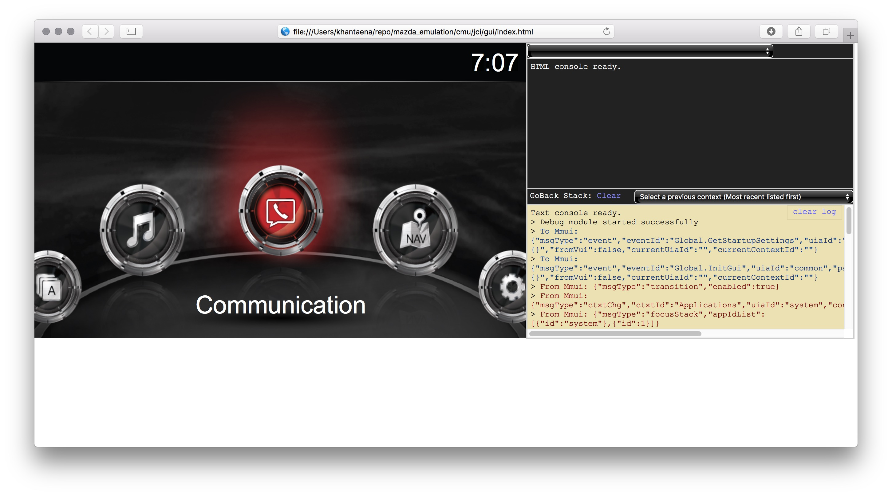
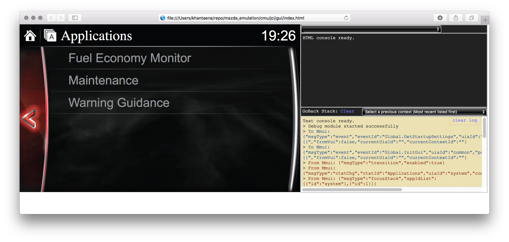
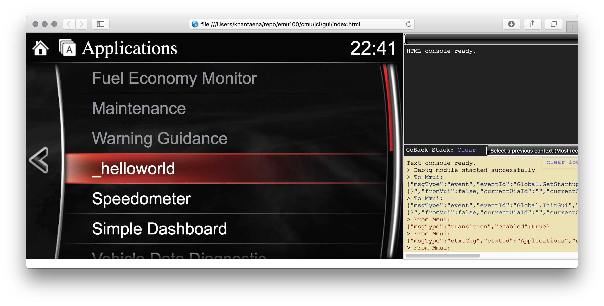

#ติดตั้ง mazda_emulation
* บน MACOSX 

1. download firemware http://www.mazda2thailand.com/index.php/topic,3338.0.html แนะนำให้ใช้ 100A-ADR พบปัญหา 513C-ADR
2. download emulator

 ```bash
cd
mkdir repo
cd repo
git clone https://github.com/checksummaster/mazda_emulation
cd mazda_emulation
 ```
ย้าย firmware ไว้ที่ไดเร็คทอรี่ `mazda_emulation`
3. extract firmware

 ```bash
./extract.sh <firmware>
 ```

4. ติดตั้ง nodejs

 ```bash
sudo port install nodejs
 ```
5. รันโปรแกรม

 ```bash
node server.js
 ```
อาจจะต้องติดตั้งโปรแกรมที่เกี่ยวข้อง ใช้คำสั่ง

 ```bash
sudo npm install <ชื่อ>
 ```

6. ใช้ finder เปิดไฟล์ `cmu150_ADR_56.xxxx.xxx/jci/gui/index.html`

* ตัวอย่าง



มีดีเลย์ประมาณ 10วินาทีก่อน เมนูจะขึ้นครบ

7. ต้องการลองใช้ apps ที่มากับเฟิร์มแวร์ แก้ไฟล์ `boot.js` บรรทัดแรก เปลี่ยนจาก `UseNativeSDK = false;` เป็น `UseNativeSDK = true;`

```bash
var UseNativeSDK = true; // false for CASDK
```
